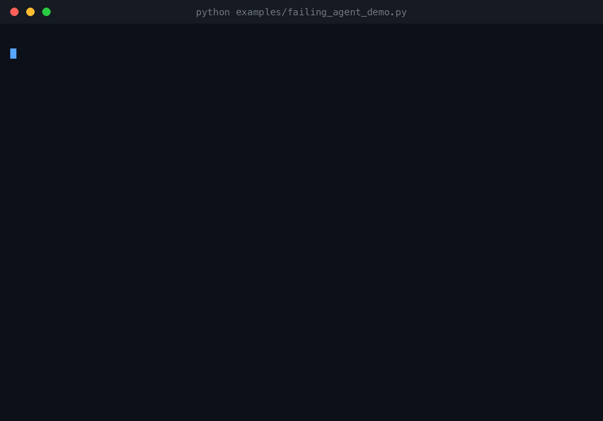
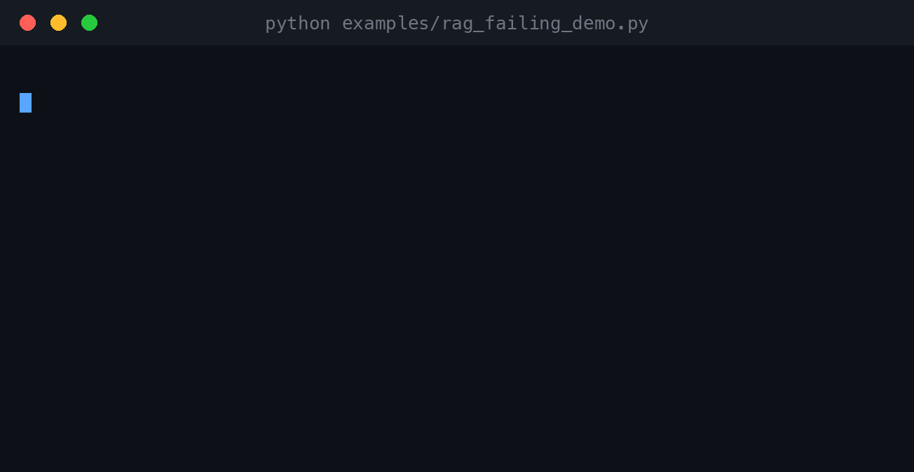
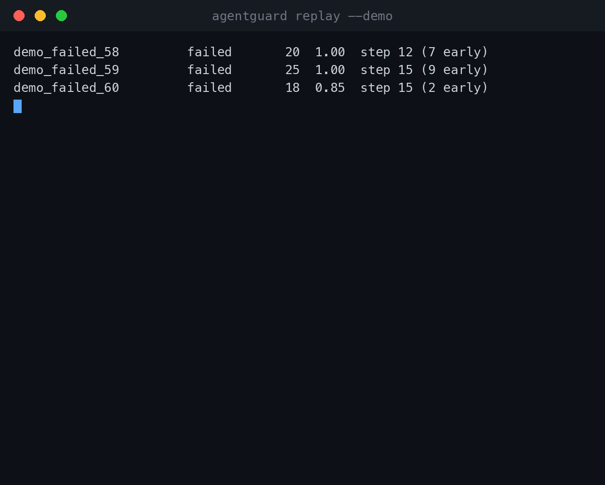
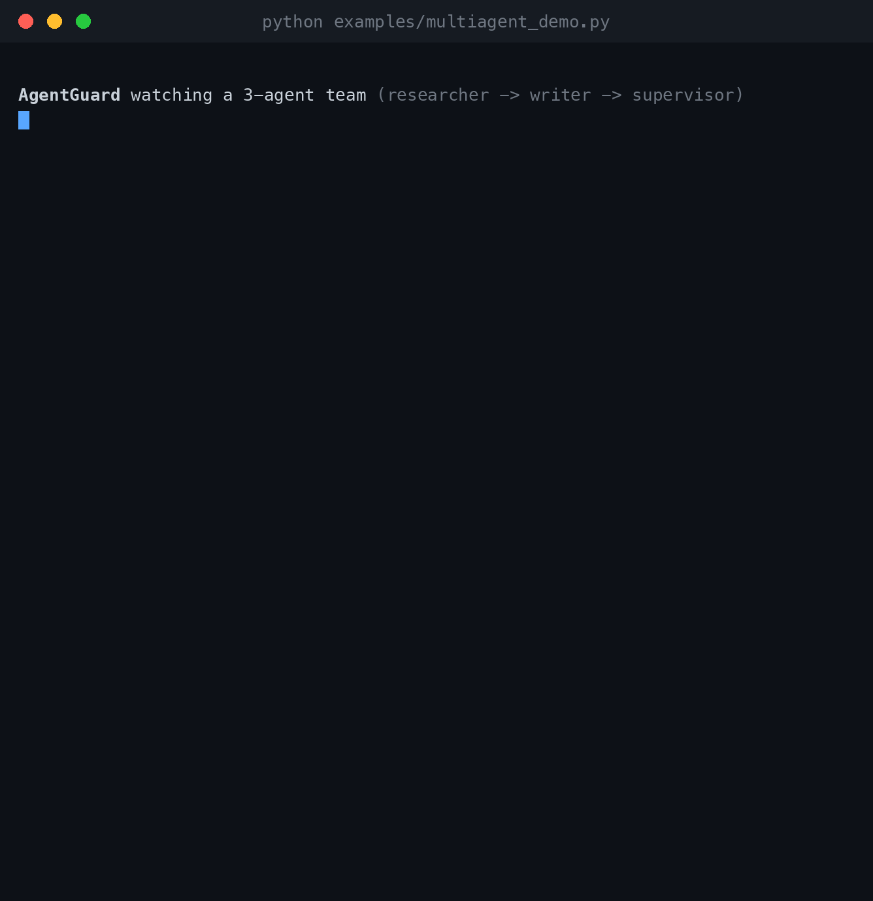
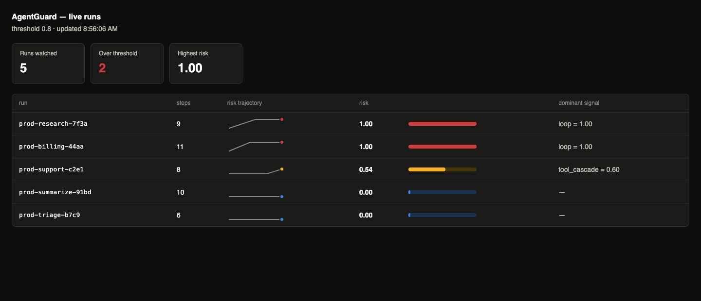

# AgentGuard

[](https://github.com/Prakhar998/agentguard/actions/workflows/ci.yml)   [](LICENSE)

**Predict LLM-agent-run failures in real time — and intervene before the tokens are spent.**

Every agent-observability tool today (LangSmith, Langfuse, Arize, Braintrust) is
*reactive*: it shows you the trace after the run burned $30 and forty steps going
in circles. AgentGuard is *predictive*: it watches the step stream live, scores
the risk that the run is going off the rails, and proposes an intervention
(halt / reset context / escalate / downgrade) **early enough for it to matter**.



| what | in one line | try it |
|---|---|---|
| [8-line API](#the-whole-api-is-8-lines) | wrap any agent loop, read `w.risk`, propose an intervention | `python examples/failing_agent_demo.py` |
| [9 predictors](#predictors) | loops, error cascades, budget blowout, semantic/goal drift, RAG drift, hallucination precursors, prompt injection, a learned model | — |
| [RAG guarding](#guarding-rag-pipelines) | re-retrieval loops + groundedness, scored live | `python examples/rag_failing_demo.py` |
| [Multi-agent](#guarding-agent-teams-multi-agent--langgraph) | cascade prediction across an agent team; LangGraph adapter | `python examples/multiagent_demo.py` |
| [Backtest](#backtest-on-your-own-traces) | replay your traces: catch rate, lead time, false alarms | `agentguard replay --demo` |
| [Real-trace benchmark](#benchmarked-on-real-agent-runs) | honest numbers on 300 real SWE-agent runs | `python benchmarks/swe_agent_bench.py` |
| [Live sidecar](#live-production-sidecar) | OTLP/OpenInference ingest + live risk dashboard | `agentguard serve` |
| [Policies](#intervention-policies--escalation) | rules → interventions → Slack/webhook escalation | — |
| [Claude Code hook](#guarding-coding-agents-claude-code) | hold a looping coding session for confirmation | `agentguard hook` |
| [MCP server](#mcp-server--agents-that-monitor-themselves) | any MCP-capable agent can self-monitor | `agentguard mcp` |
| [Failure memory](#failure-memory-rag-over-past-failures) | RAG over past failures: explain alarms, cluster failure modes | — |

## Where this comes from: ProactiveGuard

AgentGuard is a direct re-targeting of my published failure-prediction work,
**[ProactiveGuard: Deep Learning-Based Predictive Failure Detection for
Distributed Consensus Systems]** — same thesis, new domain.

ProactiveGuard's finding was that consensus-node failures don't happen out of
nowhere: they are preceded by observable degradation (rising WAL-fsync latency,
climbing heartbeat latency), and a model trained on those precursors can flag a
node *before* it fails, cutting per-failure downtime by 86.7% via graceful
leader handoff.

LLM agent runs degrade the same way. The failure precursors just have different
names:

| ProactiveGuard (consensus nodes) | AgentGuard (agent runs) |
|---|---|
| WAL fsync latency rising | tool-error rate rising |
| heartbeat latency climbing | step latency / token velocity climbing |
| leader-election churn | repeated tool-call cycles (loops) |
| log-replication lag | semantic drift — the run stops making progress |
| reactive timeout detectors | reactive trace viewers |
| predict → graceful handoff | predict → halt / reset / escalate / downgrade |

The learned risk model here is a port of the ProactiveGuard architecture, not a
lookalike: the same learnable per-feature attention gate, residual connections,
focal loss `-(1-p_t)² log(p_t)` for the rare-failure class imbalance, and the
same ensemble (five bagged attention-MLPs + a Random Forest at double weight).

## Install

```bash
pip install agentguard-predict                 # zero-dependency core
pip install "agentguard-predict[langchain]"    # + LangChain callback adapter
pip install "agentguard-predict[embeddings]"   # + sentence-transformers drift detection
pip install "agentguard-predict[memory]"       # + Chroma-backed failure memory
pip install "agentguard-predict[model]"        # + the learned risk model (numpy/sklearn)
pip install "agentguard-predict[mcp]"          # + the MCP server
```

The distribution is `agentguard-predict` (the bare name is squatted on PyPI);
the import is still `import agentguard`.

## The whole API is 8 lines

```python
from agentguard import Guard

guard = Guard(predictors=["loop", "tool_cascade", "budget_drift", "semantic_drift"])

with guard.watch() as w:
    for step in my_agent_loop():        # ANY agent — raw, LangChain, LlamaIndex
        w.record(step)                  # dict or Step; normalized internally
        if w.risk > 0.8:
            w.intervene("halt")         # stop before wasting 20 more steps / $30
```

`w.record` accepts a plain dict (`{"kind": "tool_call", "name": "search",
"content": {...}}`) or a `Step`. `w.risk` is the current calibrated 0–1 risk;
`w.subscores` breaks it down per predictor for explainability. `w.intervene`
**proposes** — it logs and returns an `Intervention`; your app owns the control
flow.

Try it now, no keys, no services:

```bash
python examples/failing_agent_demo.py
```

## Predictors

| predictor | type | what it catches |
|---|---|---|
| `loop` | deterministic | repeated tool calls with near-identical args; search→summarize→search cycles; the same LLM output recurring |
| `tool_cascade` | deterministic | tool errors clustering (one error is noise, three in five steps is a cascade) |
| `budget_drift` | deterministic | token velocity blowing past the run's own early baseline |
| `semantic_drift` | embeddings | the run stalling (restating itself) or oscillating (A→B→A) in embedding space instead of progressing |
| `retrieval_drift` | embeddings (RAG) | re-retrieval loops (same chunks again and again) and retrieval starvation (query→chunk relevance decaying) |
| `grounding_gap` | embeddings (RAG) | LLM outputs drifting away from the retrieved context — a hallucination precursor, scored live |
| `goal_drift` | embeddings | outputs wandering away from the stated goal (`guard.watch(goal="...")`) |
| `injection` | deterministic | context poisoning: instruction-shaped payloads arriving in tool results and retrieved chunks ("ignore previous instructions...") — with a named-pattern audit trail |
| `model` | learned | the ported ProactiveGuard ensemble fusing all sub-signals into one risk |

Sub-scores are fused with a weighted noisy-OR (one strong signal dominates;
several weak signals compound) and can be calibrated to a real probability with
split-conformal calibration (`ConformalCalibrator`) — a risk score is only as
trustworthy as its calibration.

### The learned model

```bash
pip install "agentguard-predict[model]"
python -m agentguard.train        # bootstrap on labeled synthetic scenario runs
```

```python
guard = Guard(predictors=["model"], threshold=0.8)
```

Training mirrors the ProactiveGuard bootstrap: generate scenario runs
(healthy / loop / cascade / budget-blowout) with gradual failure onset, label
each step `healthy → degraded → failing` by distance-to-failure, train the
ensemble on windowed features. A pre-trained model ships with the package;
retrain on your own traced runs by swapping `generate_runs`.

The attention gate is inspectable — ask the model what it found predictive:

```
learned feature attention (top 6):
  loop_slope             0.515
  budget_drift_max       0.513
  error_rate             0.512
```

(In the paper, the analogous top features were WAL-fsync and heartbeat latency.)

## Guarding RAG pipelines

RAG agents fail in their own ways, all observable in embedding space while
the run is live. Emit a `RETRIEVAL` step (or let the LangChain adapter's
retriever hooks do it) and two predictors watch it:

```python
from agentguard import Guard
from agentguard.adapters.raw import retrieval, llm_output

guard = Guard(predictors=["retrieval_drift", "grounding_gap"])
with guard.watch() as w:
    w.record(retrieval(query, chunks))       # what the vector store returned
    w.record(llm_output(answer, tokens=n))   # graded against those sources
```

`grounding_gap` is groundedness made *predictive*: instead of a post-hoc
eval score, the gap between outputs and retrieved context is tracked
against the run's own best grounding, so the hallucination spiral is
flagged while a `reset_context` can still save the run. See it happen:

```bash
python examples/rag_failing_demo.py
```



## Backtest on your own traces

```bash
agentguard replay traces.jsonl        # your exported runs (JSONL, see below)
agentguard replay --demo              # synthesized runs, no file needed
```

Replays historical runs through the predictors and reports the numbers
that sell prediction — the same early-warning metrics as the
ProactiveGuard paper:



Trace format is one JSON object per line — steps plus optional outcome
lines (`{"run_id": "r1", "outcome": "failed"}`); anything you can't export
simply doesn't contribute. Use `--json` for machine-readable output and
`--predictors`/`--threshold` to test configurations against history before
changing production.

## LangChain adapter

```python
from agentguard import Guard
from agentguard.adapters.langchain import AgentGuardCallback, AgentGuardHalt

handler = AgentGuardCallback(Guard(), auto_intervene="halt")

try:
    agent.invoke({"input": "..."}, config={"callbacks": [handler]})
except AgentGuardHalt as halt:
    print(halt.watcher.subscores)   # why it was stopped
```

Every `on_tool_start/end/error` and `on_llm_end` becomes a Step — nothing else
about your agent changes. `python examples/langchain_demo.py` runs a real
LangChain tool-calling loop (scripted fake model, so it's keyless) and shows
AgentGuard stopping it 11 turns before the agent's own iteration cap.

## Benchmarked on real agent runs

Synthetic backtests are easy; here are the numbers on **300 real SWE-agent
runs** ([nebius/SWE-agent-trajectories](https://huggingface.co/datasets/nebius/SWE-agent-trajectories)),
deterministic predictors only, threshold 0.8:

| | flagged | false alarms |
|---|---|---|
| runs that died of budget/context exhaustion (`exit_cost`/`exit_context`) | **41%**, mean **74 steps** before the end | — |
| resolved (successful) runs | — | **12%** |

At threshold 0.6 that trade is 56% / 18%. A run that submits a clean but
*wrong* patch mid-flight often looks healthy — AgentGuard predicts
dysfunction, not correctness, and the report says so explicitly. Full
methodology, threshold sweep and caveats: [benchmarks/RESULTS.md](benchmarks/RESULTS.md)
(reproduce with `python benchmarks/swe_agent_bench.py`).

## Intervention policies + escalation

Write the host's decision down once, instead of hand-rolling threshold
checks in every loop:

```python
from agentguard.policy import Policy, Rule, SlackWebhook

policy = Policy(
    rules=[
        Rule(signal="loop", threshold=0.8, action="reset_context"),
        Rule(signal="budget_drift", threshold=0.7, sustain=3, action="downgrade"),
        Rule(threshold=0.9, action="escalate"),        # fused risk, any cause
    ],
    notifiers=[SlackWebhook("https://hooks.slack.com/services/...")],
)
guard = Guard(predictors=[...], on_step=policy)
```

Triggered rules record an `Intervention` on the run and notify (Slack or
any JSON webhook — payload includes sub-scores and the similar past
failures from the failure memory). Enforcement still belongs to your
loop; notifiers never raise into the run.

## Guarding agent teams (multi-agent / LangGraph)

Multi-agent failures cascade: a researcher loops, hands garbage to the
writer, the supervisor burns budget retrying both. `MultiGuard` watches
the team the way ProactiveGuard watched a cluster — per-agent watchers
plus contagion along the data-flow edges you declare:

```python
from agentguard import MultiGuard

mg = MultiGuard(predictors=["loop", "tool_cascade", "budget_drift"])
mg.add_edge("researcher", "writer")     # researcher's output feeds the writer

mg.record("researcher", step)
mg.effective_risk("writer")   # own risk + attenuated worst-upstream risk
mg.system_risk                # P(at least one agent takes the run down)
```



The writer never trips its own predictors — but its *effective* risk
climbs turns before the failure surfaces, because its input comes from an
agent at risk 0.9. The cluster-level view, kept.

For LangGraph, one callback routes every event to the right per-node
watcher via the `langgraph_node` metadata LangGraph already stamps:

```python
from agentguard.adapters.langgraph import MultiAgentCallback

handler = MultiAgentCallback(mg, auto_intervene="halt")
graph.invoke(state, config={"callbacks": [handler]})
```

## Live production sidecar

```bash
agentguard serve            # dashboard at http://127.0.0.1:4318/
```

Point your existing instrumentation at it — no agent code changes:

* **OTLP/HTTP JSON** with OpenInference conventions (Arize Phoenix /
  OpenLLMetry emit this): `POST /v1/traces`. LLM / TOOL / RETRIEVER spans
  become Steps; runs are keyed by trace id.
* **Native**: `POST /ingest {"run_id": "...", "step": {...}}` from anywhere.



Every concurrent run with its risk trajectory sparkline, a severity
meter, and the dominant signal — the reactive-tools view, made
predictive. `GET /runs` serves the same state as JSON for your own
alerting.

## Guarding coding agents (Claude Code)

AgentGuard ships as a Claude Code hook — a coding session that starts
looping on the same failing command gets held for confirmation instead of
burning the afternoon. In `.claude/settings.json`:

```json
{
  "hooks": {
    "PreToolUse":  [{"matcher": "*", "hooks": [{"type": "command", "command": "agentguard hook"}]}],
    "PostToolUse": [{"matcher": "*", "hooks": [{"type": "command", "command": "agentguard hook"}]}]
  }
}
```

At the risk threshold the hook answers with a permission "ask" — the human
decides, with the sub-scores as the reason. Same discipline, new host.

## MCP server — agents that monitor themselves

```bash
pip install "agentguard-predict[mcp]"
claude mcp add agentguard -- agentguard mcp
```

Exposes `start_run` / `record_step` / `get_risk` / `explain_run` /
`end_run` over MCP, so any MCP-capable agent can stream its own steps in
and read its risk back — and `explain_run` retrieves similar past
failures from the server's failure memory across runs.

## Failure memory (RAG over past failures)

```python
from agentguard.memory import FailureMemory

guard = Guard(memory=FailureMemory())   # in-memory store; Chroma via [memory]

# ... failed runs get stored on close; on the next risky run:
for match in watcher.explain(k=3):
    print(f"{match['similarity']:.2f}  {match['summary']}")
# 0.94  dominant signal loop; loop=1.00 ...; tool tail: search -> summarize -> search
```

Failure *signatures* (sub-score trajectory + tool-sequence tail) are embedded
into a vector store; a new high-risk run retrieves its nearest past failures so
the alert reads *"this looks like the 14 past runs that looped on
search→summarize→search"* — retrieval-augmented explanation.

Retrieval is **hybrid** by default: dense signature-text embeddings, a
*trajectory embedding* of the sub-score time series (so a slow-ramp loop
matches other slow-ramp loops by shape), and keyword overlap, fused with
reciprocal-rank fusion. Pick one with `mode="dense" | "trajectory" | "keyword"`.

Once enough failures accumulate, cluster them into a taxonomy:

```python
for cluster in memory.taxonomy():
    print(f"{cluster['size']} runs — {cluster['exemplar']}")
# 14 runs — dominant signal loop; loop=1.00 ...; tool tail: search -> summarize -> search
#  6 runs — dominant signal tool_cascade; ...; tool tail: fetch -> fetch -> fetch
```

Pure-python k-means over trajectory embeddings, k chosen by silhouette —
your agent's failure modes, named and counted.

## What AgentGuard is not

- **Not an agent framework.** One job: watch a run, predict failure, propose an
  intervention. Bring your own agent.
- **Not tracing/observability.** Use LangSmith/Langfuse for the post-mortem;
  AgentGuard exists so there are fewer post-mortems.
- **Not autonomous.** Interventions are proposed and logged; your code decides.

## Development

```bash
python -m unittest discover -s tests   # core tests need nothing but Python
pip install -e . numpy scikit-learn langchain-core mcp   # full suite + demos
```

CI runs the no-dependency matrix (3.9 / 3.11 / 3.13) plus a full-extras
job that executes every demo end-to-end. MIT licensed.
